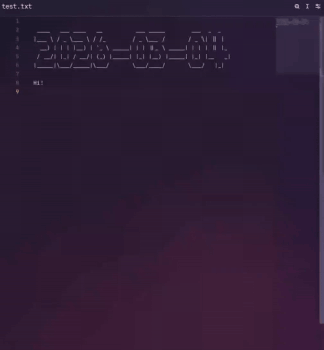

# Lucy d(a)emon — modular notes manager

Your notes are just files. Use any editor you like. No editor plugins. Git is your cloud.

Lucy daemon monitors your note folder. Every time you edit something, it runs modules on that file (formatter, sync, git, etc).
  


Lucy can also read Unix-style flags written inside the note file and pass them to modules.
It could be an execution command or some settings.

## Example of use
If `README.md` is one of your notes, you can write command flags directly inside it:

Rename `README.md` to `DONOTreadme.md`:

```--r DONOTreadme.md```

Execute the terminal command (output will be written directly to the file):

```--c neofetch```


Then press ```CTRL+S``` - Lucy will detect the change and run the modules.

### Use cases  
- Auto-format files, rename and sort it
- Sync notes between formats and programs
- Git auto-commit
- Calendar integration
- Sync your system widgets: [KDE Plasma demo](media/plasma_sync.mp4)
- Write your own module!

### How to sync with mobile?
Use Lucy's Git module together with [GitSync Android app](https://github.com/ViscousPot/GitSync) and [Markor](https://github.com/gsantner/markor) text editor.

## Theory

### Flags system
You can provide flags in three places:

1. Inside the note file (for per-note behavior)
2. In config.txt (global defaults)
3. At startup: ```python3 main.py --some-flag```

### System module

```--help``` for help message: 
```
* --mods: print loaded modules and their priorities
* --config: print config values that differ from defaults
* --man list: print all arguments (no descriptions)
* --man full: print all arguments with descriptions
* --man <name>: print one argument with description (example: --man todo)
```


```--mods``` to see loaded modules:
```
* sys (0)
* banner (10)
* todo (10)
* renamer (20)
* plasma_sync (30)
* cmd (50)
```

```--man list``` for list all flag arguments.

`--man flag_arg_here` for help with any flag argument.

```--man man``` :

```
* --man: Argument manual. Use: --man list OR --man full OR --man <name> (example: --man todo). (type=str, default=None)
```

## Install

Tested on Fedora GNU+Linux.

1. Clone the repository:
```
git clone https://codeberg.org/Vindetta/lucy_notes_daemon && cd lucy_notes_daemon
```
   
2. Install dependencies:
```
pip install -r requirements.txt
```

3. Setup ```--sys-notes-dirs``` in ```config.txt```

4. Run the program:
```
python3 main.py
```

**Turn on file auto-update in your text editor!**

## Modules

To add new modules, you need to edit the list in `main.py`.
Hot reload and install/uninstall commands are in the roadmap. Sorry.

### List of available modules

**Basic:**
- `sys`: runtime information, man(ual) messages
- `todo_formatter`: format points to Markdown-style checkboxes  
  `- point` → `- [ ] point`
- `banner`: prints an ASCII banner with the current date or custom text
- `renamer`: renames a file using `--r name`
- `today`: archives stale `now.md` into `past.md`

**Experimental (disabled by default):**
- `git`: auto commit, pull, push, etc. Please install GIT cli. 
- `plasma_sync`: sync KDE Plasma widgets ([see video](media/plasma_sync.mp4))
- `cmd`: run a terminal command with `--c command`.  
  Cmd module may cause security issues when used with the `git`.
